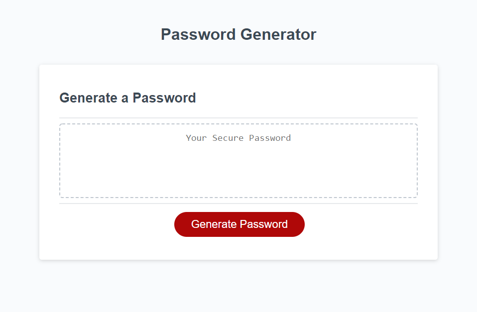

# Random Password Generator

This is a webpage that will generate a random password based on critera selected by the user. The user can choose a password length of 8 to 128 and then select which characters they want the password to comprise of; lowercase, uppercase, numbers, and/or symbols.

## Screenshot

## Link to Website

[Deployed Application](https://vasilyg10.github.io/random-password-generator/)
